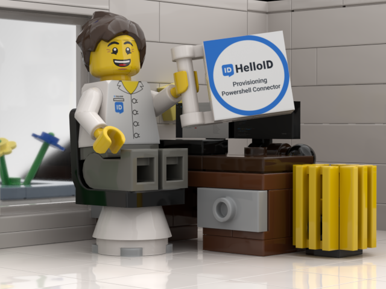

- 🔭 Most of my time is dedicated to the development of connectors that you can use in [HelloID](https://www.tools4ever.com/software/helloid-idaas-cloud-single-sign-on/) 
- ⚡ When I'm not working, you will find me tinkering with C# / PowerShell and recently; TypeScript
- 💬 Ask me about anything! always happy to help

### Github streaks

### 🧰 Technologies

     

### HelloID

>❓If you have questions or if you need help with HelloID, make sure to visit our forum: https://forum.helloid.com or our docs page: https://docs.helloid.com/hc/en-us

#### Available connectors

- https://github.com/orgs/Tools4everBV/repositories
- https://www.tools4ever.nl/connectoren/

#### Recently build connectors

|Name|Repo|
--|--|
Zivver | https://github.com/Tools4everBV/HelloID-Conn-Prov-Target-Zivver |
Zermelo | https://github.com/Tools4everBV/HelloID-Conn-Prov-Target-Zermelo |
OutSystems | https://github.com/Tools4everBV/HelloID-Conn-Prov-Target-OutSystems-RoleManagement

### Blog

https://jeroenbl.github.io/

<!--
**mufana/mufana** is a ✨ _special_ ✨ repository because its `README.md` (this file) appears on your GitHub profile.
Here are some ideas to get you started:

- 🔭 I’m currently working on ...
- 🌱 I’m currently learning ...
- 👯 I’m looking to collaborate on ...
- 🤔 I’m looking for help with ...
- 💬 Ask me about ...
- 📫 How to reach me: ...
- 😄 Pronouns: ...
- ⚡ Fun fact: ...
-->
